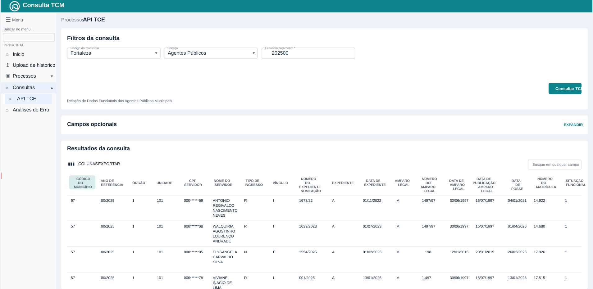

# Consulta TCE

Case profissional de uma aplicacao full stack voltada para consulta, normalizacao e analise de dados publicos.

[Acessar aplicacao em producao](https://consultatce-dev.ssinformatica.net/)
## Visao geral

Este repositorio documenta um projeto real desenvolvido em contexto corporativo para apoiar rotinas operacionais de consulta, consolidacao e validacao de informacoes publicas.

A solucao centraliza fluxos de consulta em uma interface unica, organiza filtros operacionais, padroniza dados consumidos por integracoes externas e oferece recursos de exportacao e apoio a analise de inconsistencias.

Por questoes de confidencialidade e propriedade intelectual, o codigo-fonte nao esta publico. Aqui eu apresento o produto, a arquitetura em alto nivel, a stack e a minha contribuicao tecnica.

## Destaques do projeto

- aplicacao full stack com backend em Ruby on Rails e frontend em Preact + TypeScript
- integracao com fonte externa de dados publicos
- consultas operacionais com filtros e paginacao
- exportacao de resultados em CSV
- fluxo de analise de divergencias em arquivos CSV
- ambiente preparado para execucao conteinerizada com Docker

## Aplicacao em producao

Link publico:

- https://consultatce-dev.ssinformatica.net/

## Interface em destaque

Consulta da API TCE com grid preenchido a partir de dados reais do endpoint `agentes_publicos`, usando o municipio `057` e o exercicio `202500`.

## Problema resolvido

O projeto foi concebido para reduzir atrito em rotinas que dependem de consulta e validacao de dados publicos. Em vez de espalhar esse trabalho entre fontes externas, verificacoes manuais e planilhas auxiliares, a aplicacao concentra o fluxo em um unico produto com experiencia de uso orientada a operacao.

## Principais funcionalidades

- consulta paginada de contratos, licitacoes e veiculos
- filtros por municipio, orgao e outros criterios operacionais
- integracao com API externa para consulta de dados publicos
- exibicao estruturada de resultados em interface web
- exportacao dos dados consultados para CSV
- analise de arquivos CSV para apoio a identificacao de inconsistencias

## Stack

- Ruby on Rails 8
- PostgreSQL
- Preact
- TypeScript
- Vite
- Docker

## Arquitetura em alto nivel

O sistema foi organizado em dois blocos principais:

- backend responsavel por expor endpoints, integrar dados externos, normalizar respostas, paginar resultados e apoiar fluxos de analise
- frontend responsavel pela experiencia de consulta, filtros, apresentacao dos dados e exportacao

Essa separacao permitiu evoluir a interface e as integracoes mantendo um fluxo consistente de dados entre camada de servico e camada de apresentacao.

## Minha atuacao

Atuei no desenvolvimento full stack da solucao, com participacao em:

- implementacao e evolucao de funcionalidades no backend
- construcao e manutencao da interface web
- integracao com servicos externos
- tratamento e normalizacao de dados para consumo no frontend
- implementacao de filtros, consultas e exportacao de resultados
- apoio aos fluxos de analise de divergencias em arquivos processados

## Desafios tecnicos

- organizar integracoes externas com respostas consistentes para a interface
- estruturar consultas operacionais com filtros reutilizaveis
- tratar importacao e leitura de arquivos CSV
- exibir e exportar dados de forma padronizada
- equilibrar experiencia de uso com necessidades operacionais reais

## Resultado

- centralizacao do fluxo de consulta em uma unica aplicacao
- ganho de produtividade em rotinas operacionais
- melhor consistencia na exibicao e exportacao dos dados
- suporte mais eficiente para validacao de inconsistencias

## Confidencialidade

Este repositorio documenta um projeto profissional real, mas nao inclui codigo proprietario, regras internas de negocio, credenciais, dados sensiveis ou detalhes exclusivos da empresa.

## Tecnologias e temas

`Ruby on Rails` `Preact` `TypeScript` `PostgreSQL` `Docker` `APIs REST` `Integracao de Sistemas` `CSV` `Full Stack`
